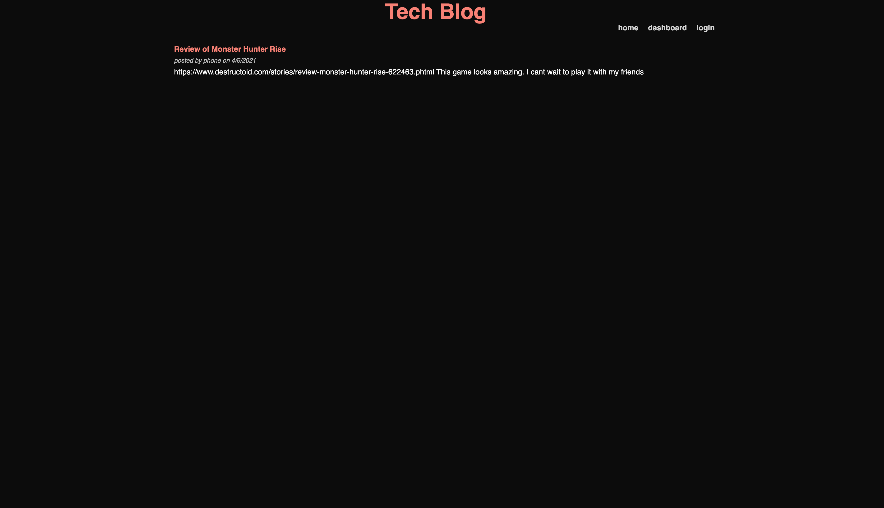

# TECH BLOG

## Description
The blog allows users to create accounts and log in where they can then create new blog posts or comment on existing ones. Logged in users can also edit or delete their own posts. Users do not need to be logged into read blog posts.

### Screenshot

### Link
[Tech Blog](https://frozen-cliffs-42253.herokuapp.com/)

## Questions
If you have questions, feel free to contact me here:
* GitHub: [agustinxmtz](https://github.com/agustinxmtz)
